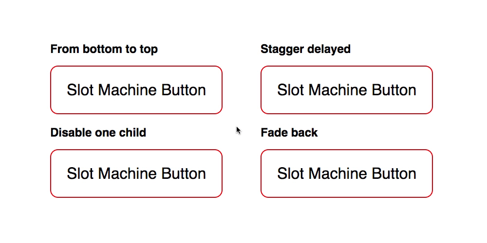

# Angular 2+ Slot Machine Button



Also see [React Slot Machine Button](https://github.com/Jam3/slot-machine-button)

## Installation

There is currently not an official tool to publish a `NgModule` as a npm package. So one way to use it for now is to download and put it into a project, or maybe use `git-submodule`.

But according to the Angular team, there would be something coming out with Angular 6; so stay tuned. ([reference issue](https://github.com/angular/angular-cli/issues/6510))

## Example

This repo is a demo itself, run `npm start` after running `npm install` to see.

#### [Example Usage](src/app/demo/demo.component.html)

## Inputs

```TypeScript
// ng-slot-machine-button
@Input() activeOnHover: boolean;
@Input() bottomToTop: boolean;
@Input() delay = 0;
@Input() duration = 0.5;
@Input() ease = Expo.easeInOut;
@Input() fadeDuration: number;
@Input() groupID: number;
@Input() isActive: boolean;
// Fade Back
@Input() fadeBack: boolean;
@Input() fadeBackDuration: number;
@Input() fadeBackEase = Linear.easeNone;
```

```TypeScript
// ng-slot-machine-wheel
@Input() groupID: number;
@Input() delay = 0;
```
